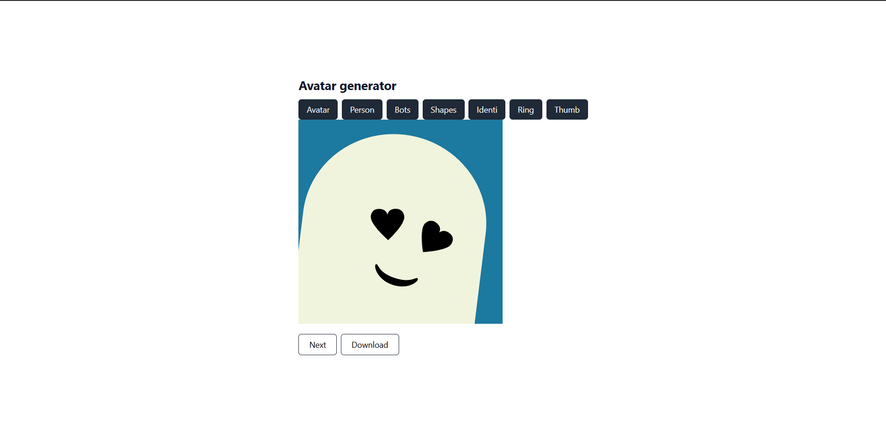
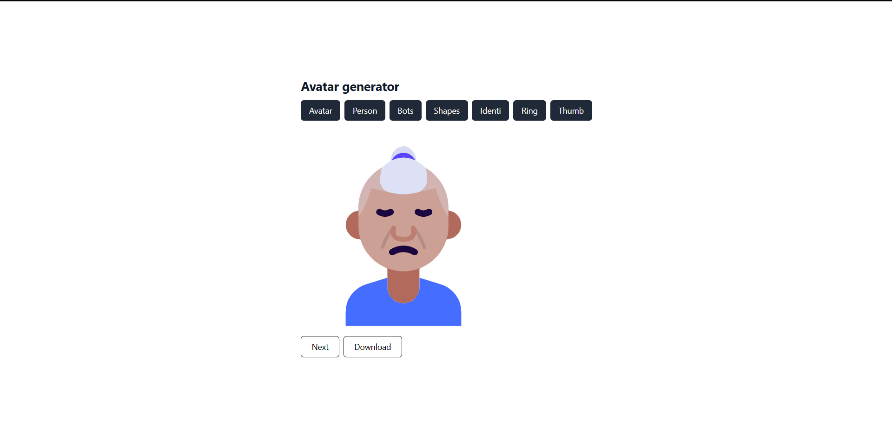

This project is Avatar Generator.
User can click on the styles to change the type of avatar and click next to get the new random one.
And can also download using download button.
This project uses dicebar API.

Languages : React js, Tailwind Css

How to clone: You will need to install react js and related dependencies. 
Follow instructions from offical website. Click here - https://tailwindcss.com/docs/guides/create-react-app 
Wrap the Avatar.js file in the App.js. Be aware of file structure file importing.

Enjoy !

Two png files are uploaded for preview.

