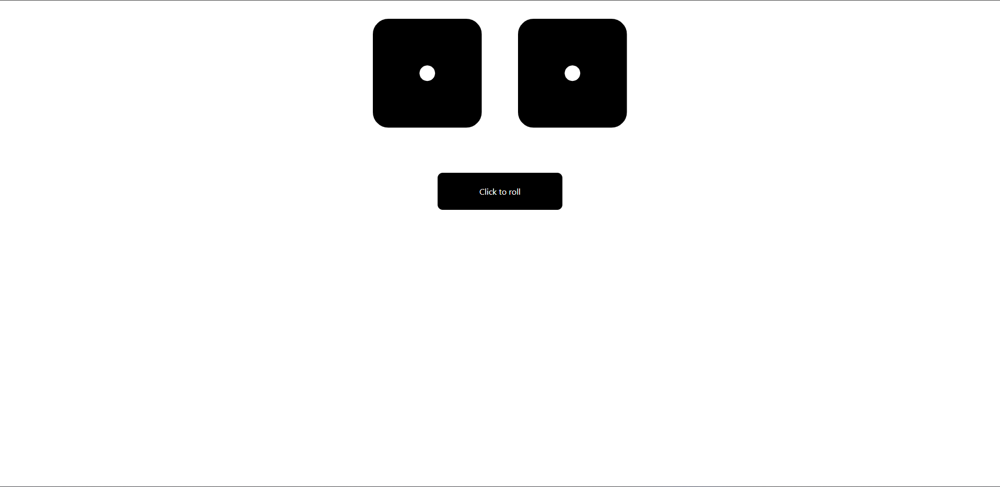
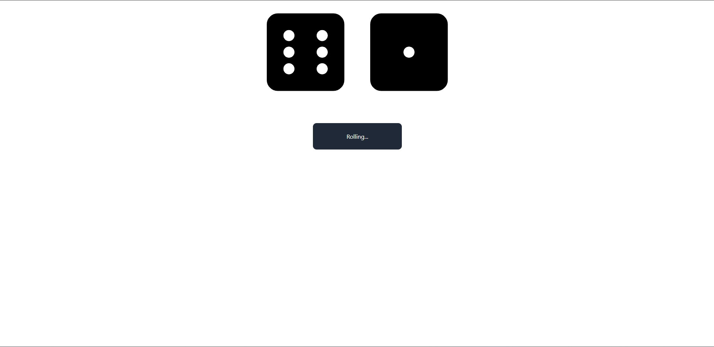

This is dicerolling project. There are two dices and will roll randomly on button onClick.
Language : React js, Tailwind css
How to use : You will need to install react with tailwind first. 
Wrap "DiceRolling.js" in the "App.js".
Install fontawesome.

