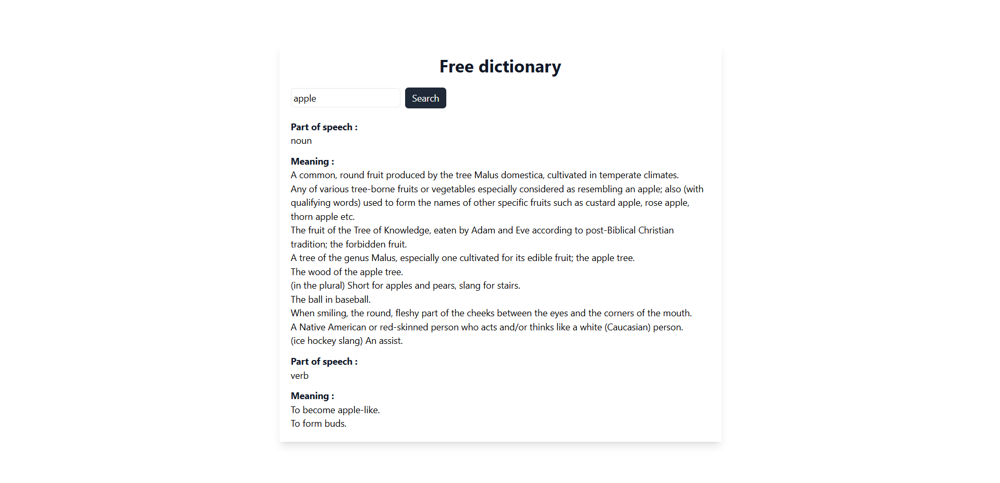

This is dictionary app.
User can type an English word and will get result of its meaning and example sentence.
This project uses Dictionary API.

Languages : React js, Tailwind Css

How to clone: You will need to install react js and related dependencies. Follow instructions from offical website. Click here - https://tailwindcss.com/docs/guides/create-react-app.

About the files : Dictionary.js is the main file. Wrap Dictionary.js inside the App.js. (And don't forget to import). You will need to adjust the import location according to your file structure.

