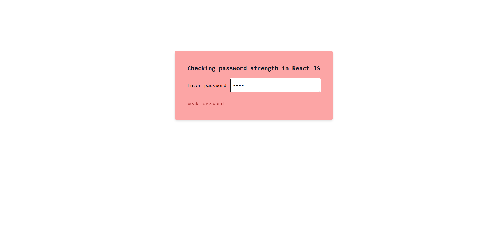
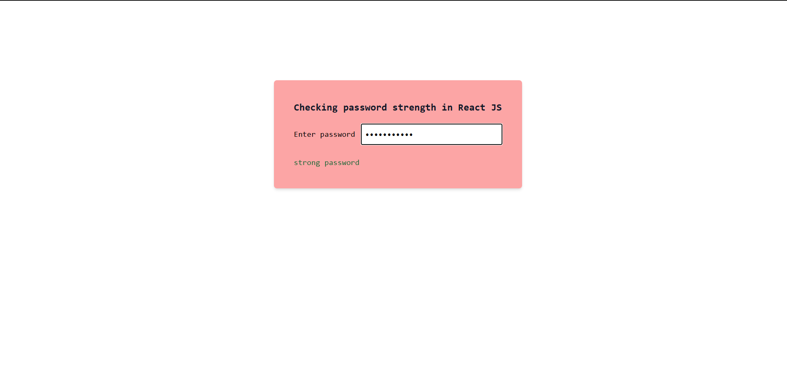

This project is Password validator. 
password will be checked if they have at least 8 characters, one minimum lowercase, one minimum uppercase, one minimun symbol and one minimun number.
It is used validator from react.

Languages : React js, Tailwind Css

How to clone: You will need to install react js and related dependencies. 
Follow instructions from offical website. 
Click here - https://tailwindcss.com/docs/guides/create-react-app 
Wrap the PasswordValidator.js file in the App.js. Be aware of file structure file importing.

Enjoy !

Two png files are uploaded for preview.

