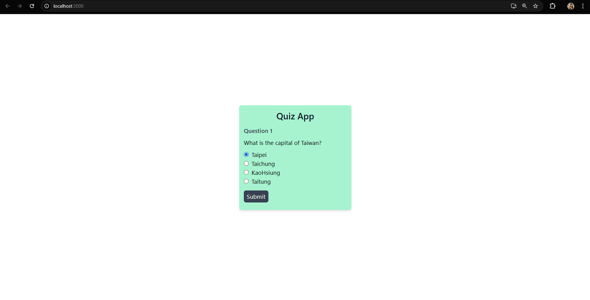
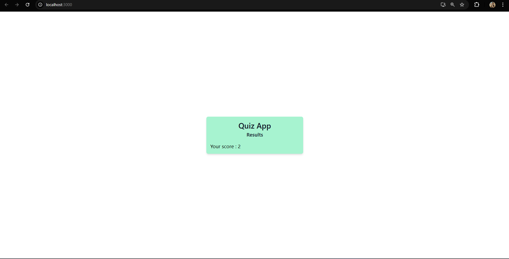

This is project Quiz App. 
User will answer the questions by clicking radio buttons and will keep the score. Score will be displayed at the last.

Languages : React js, Tailwind Css

How to clone: You will need to install react js and related dependencies. Follow instructions from offical website. Click here - https://tailwindcss.com/docs/guides/create-react-app.

About the files :
QuizApp.js is the main file. Wrap QuizApp.js inside the App.js. (And don't forget to input).
You will need to adjust the import location according to your file structure.

Two png files are uploaded for preview.

