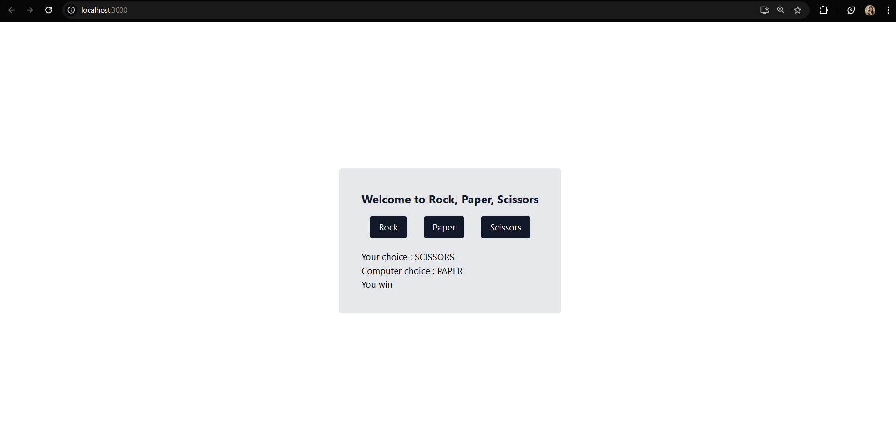
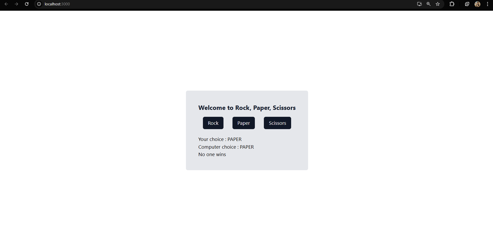

This is rock paper scissors game.
languages : React js, Tailwind css.
how to clone : 
You have to install react first. And wrap the "RockPaperScissors.js" inside the App.js file.
You have to install other related dependencies to react. Follow the instructions from offical website.
Click here - https://tailwindcss.com/docs/guides/create-react-app

Enjoy

